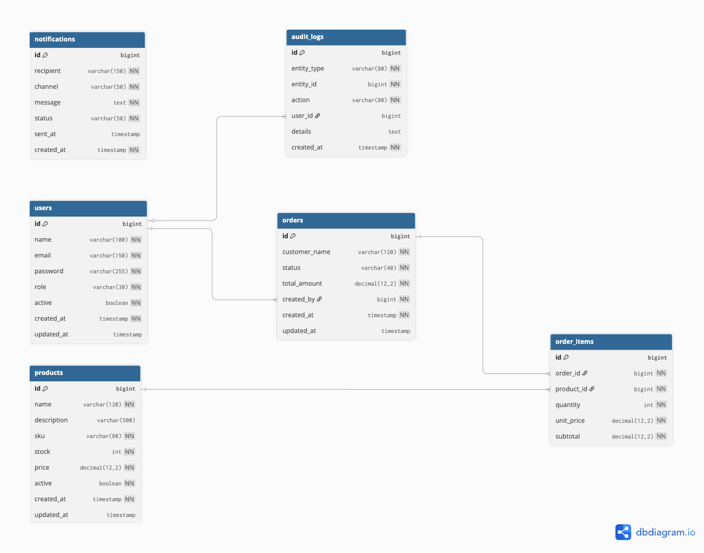

# Database Model

## Description

OrderFlow uses a relational database model focused on order management, product stock control and audit logging.

The main business entity is the order, represented by the `orders` table. It represents a business request created by a user and composed of multiple products through `order_items`.

---

## Initial Entities

### User

Represents a system user.

Main fields:
- id
- name
- email
- password
- role
- active

### Product

Represents a product available for ordering.

Main fields:
- id
- name
- description
- sku
- stock
- price
- active

### Order

Represents a customer order.

Main fields:
- id
- customer_name
- created_at
- status
- total_amount
- created_by

### OrderItem

Represents a product inside an order.

Main fields:
- id
- order_id
- product_id
- quantity
- unit_price
- subtotal

### AuditLog

Represents an audit record for important actions in the system.

Main fields:
- id
- entity_type
- entity_id
- action
- created_at
- user_id
- details

### Notification

Represents a notification generated by the system.

Main fields:
- id
- recipient
- channel
- message
- status
- sent_at
- created_at

---

## Tables and Fields

### users

| Field | Type | Constraints |
|---|---|---|
| id | BIGINT | PK |
| name | VARCHAR(100) | NOT NULL |
| email | VARCHAR(150) | NOT NULL, UNIQUE |
| password | VARCHAR(255) | NOT NULL |
| role | VARCHAR(30) | NOT NULL |
| active | BOOLEAN | NOT NULL |
| created_at | TIMESTAMP | NOT NULL |
| updated_at | TIMESTAMP | NULL |

---

### products

| Field | Type | Constraints |
|---|---|---|
| id | BIGINT | PK |
| name | VARCHAR(120) | NOT NULL |
| description | VARCHAR(500) | NULL |
| sku | VARCHAR(80) | NOT NULL, UNIQUE |
| stock | INTEGER | NOT NULL, >= 0 |
| price | DECIMAL(12,2) | NOT NULL, > 0 |
| active | BOOLEAN | NOT NULL |
| created_at | TIMESTAMP | NOT NULL |
| updated_at | TIMESTAMP | NULL |

---

### orders

| Field | Type | Constraints |
|---|---|---|
| id | BIGINT | PK |
| customer_name | VARCHAR(120) | NOT NULL |
| status | VARCHAR(40) | NOT NULL |
| total_amount | DECIMAL(12,2) | NOT NULL, >= 0 |
| created_by | BIGINT | FK → users.id, NOT NULL |
| created_at | TIMESTAMP | NOT NULL |
| updated_at | TIMESTAMP | NULL |

---

### order_items

| Field | Type | Constraints |
|---|---|---|
| id | BIGINT | PK |
| order_id | BIGINT | FK → orders.id, NOT NULL |
| product_id | BIGINT | FK → products.id, NOT NULL |
| quantity | INTEGER | NOT NULL, > 0 |
| unit_price | DECIMAL(12,2) | NOT NULL, > 0 |
| subtotal | DECIMAL(12,2) | NOT NULL, >= 0 |

---

### audit_logs

| Field | Type | Constraints |
|---|---|---|
| id | BIGINT | PK |
| entity_type | VARCHAR(80) | NOT NULL |
| entity_id | BIGINT | NOT NULL |
| action | VARCHAR(80) | NOT NULL |
| user_id | BIGINT | FK → users.id |
| details | TEXT | NULL |
| created_at | TIMESTAMP | NOT NULL |

---

### notifications

| Field | Type | Constraints |
|---|---|---|
| id | BIGINT | PK |
| recipient | VARCHAR(150) | NOT NULL |
| channel | VARCHAR(50) | NOT NULL |
| message | TEXT | NOT NULL |
| status | VARCHAR(50) | NOT NULL |
| sent_at | TIMESTAMP | NULL |
| created_at | TIMESTAMP | NOT NULL |

---

## Relationships

### users → orders
A user can create many orders.

Relationship:
- users.id → orders.created_by
- One user can have many orders
- One order is created by one user

### orders → order_items
An order can contain multiple order items.

Relationship:
- orders.id → order_items.order_id
- One order has many order items
- One order item belongs to one order

### products → order_items
A product can appear in multiple order items.

Relationship:
- products.id → order_items.product_id
- One product can be referenced by many order items
- One order item references one product

### users → audit_logs
A user can generate multiple audit logs.

Relationship:
- users.id → audit_logs.user_id
- One user can generate many audit records

---

## ERD Diagram

